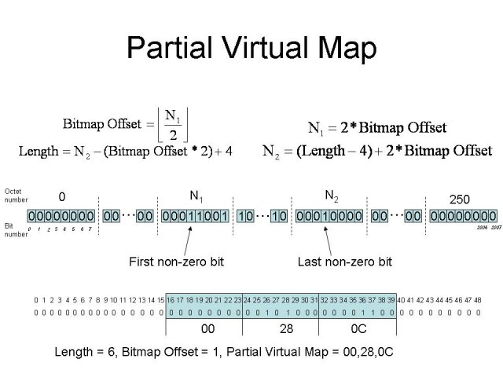

Power Savings on IEEE-802.11
============================

IEEE-802.11 was designed with power saving in mind for stations. This
section tries to summarize what the standard defines for all aspects of
power saving. It's a work in progress.

Power saving basics
-------------------

To assist stations with power saving, Access Points (APs) are designed
to buffer frames for a station when that station is in power save mode
and to transmit them later to the station when the AP knows the station
will listen. When a station is in power save mode, it turns off its
transmitter and receiver to preserve energy. It takes less power for a
station to turn its receiver on to listen to frames than to turn it its
transmitter on to transmit frames. For this reason, it's more
power-efficient for an AP to inform a station if it has buffered frames
present on the AP than to have the station poll the AP querying if
frames are present.

Target Beacon Transmission Time Time (TBTT) and beacon interval
---------------------------------------------------------------

Target Beacon Transmission Time Time (TBTT) is the time at which a node
(AP or station when in Ad-hoc) must send a beacon. The time difference
between two TBTTs is known as the *beacon interval*. The beacon interval
is given in *Time Units* (TU), each TU represents 1024 microseconds. The
beacon interval is typically set to 100 TUs (102400 microseconds, or
102.4 ms) and its length is two bytes.

Listen interval
---------------

During association, a "Listen Interval" field is provided by the
station. The *listen interval* is given in *beacon interval* units, so
essentially it tells the AP how many beacons it wants to ignore before
turning the receiver on. Two bytes are used to represent he *listen
interval*. Depending on how the AP is tuned, usually based on the amount
of space desired for buffered frames, the association may or may not be
rejected. After the *listen interval* the AP does not guarantee it will
buffer frames for the station anymore and may discard them. As might be
expected then, the *listen interval* can be used by the AP as a
guaranteed maximum time before stations listen to one of their beacons.

The TIM information element
---------------------------

The TIM information element is covered under section 7.3.2.6 of
`802.11-1999.pdf
<http://standards.ieee.org/getieee802/download/802.11-1999.pdf>`__. The
IEEE-802.11 standards chose to use a bitmap to indicate to any sleeping
listening stations if the AP has any buffered frames present for it.
Because stations should listen to at least one beacon before the *listen
interval*, the AP periodically sends this bitmap on its beacons as an
:doc:`information element <../glossary>`. The bitmask is called the
*Traffic Indication Map* and consists of 2008 bits, each bit
representing the Association Id (AID) of a station. For example, the
TIM information element allows you to transfer 1 byte up to the entire
251 bytes (2008 bits) of the TIM. You are allowed to transmit a smaller
TIM bitmap as it is expected that only a few number of stations will be
asleep. Because of this the bitmap values passed in the TIM information
element is called a *partial virtual bitmap.* To allow you to transmit
only a partial bitmap you must make use of the *bitmap control* and
*length* fields of the TIM information element.

This is what the TIM information element looks like::

   |Element ID|Length|DTIM count|DTIM period|Bitmap control|PVM|

   PVM: Partial Virtual Bitmap
   Note: all fields are 1-byte long except the PVM which can be 
         1-256 bytes long

The last 7 bits of the *Bitmap control* represent the *bitmap offset*.
To best describe *length* and *bitmap offset,* let us just quote the
relevant section::

   The Partial Virtual Bitmap field consists of octets numbered
   N1 through N2 of the traffic indication virtual bitmap, where
   N1 is the largest even number such that bits numbered 1 through
   (N1 × 8) – 1 in the bitmap are all 0 and N2 is the smallest
   number such that bits numbered (N2 + 1) × 8 through 2007 in
   the bitmap are all 0. In this case, the Bitmap Offset subfield
   value contains the number N1 / 2, and the Length field will
   be set to (N2 – N1) + 4.

To better illustrate this let we provide an image:

If no station has unicast frames buffered on the AP, the *partial
virtual bitmap* is encoded as a single zero-filled byte and the *bitmap
offset* is set to zero.

Retrieving buffered unicast frames
----------------------------------

After a station receives a TIM and if its sees that the AP has buffered
frames for it, it must send a Power Save Poll (PS-Poll) control frame to
retrieve each buffered frame on the AP. A station may go back to sleep
after the PS-Poll <-> frame exchange or once the TIM no longer has its
AID present.

Retrieving buffered multicast and broadcast frames
--------------------------------------------------

When dealing with multicast or broadcast frames the AP will buffer in
similar way *all* broadcast and multicast frames should *any* associated
station be sleeping. To indicate to stations that multicast or broadcast
frames are buffered the AID of 0 is enabled in the TIM, which
corresponds to the first bit on the TIM *bitmap control*, and **not**
the first bit of the TIM bitmap (XXX needs verification). This will not
be set on all TIMs on every beacon but on a special kind of TIM.

Delivery Traffic Indication Map (DTIM), DTIM period
---------------------------------------------------

We use a special type of TIM to to announce that the AP is about to
transmit all buffered broadcast and multicast frames called the Delivery
Traffic Indication Map (DTIM). After this DTIM the AP will send all
buffered broadcast and multicast frames. The DTIM will be sent every
DTIM period. The *DTIM period* is set on the TIM information element on
the *DTIM period* field. This field is one byte and represents the
number of *beacon intervals* that must go by before a new DTIM is sent.
The *DTIM count* on the TIM information element tells stations how many
beacons must be transmitted before receiving the next DTIM. The *DTIM
count* will be 0 when we've reached a DTIM.

Some devices can be configured to ignore the DTIMs, and this is
sometimes considered as additional *power saving* mechanisms with
different marketing names.

