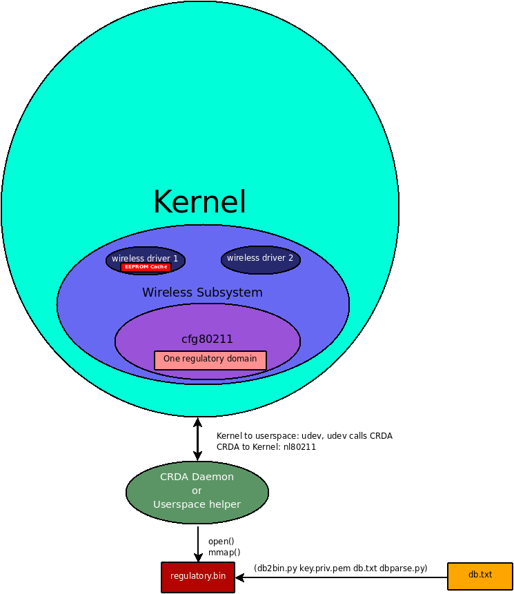

Implementation review
=====================

.. toctree::

   regulatory/crda
   regulatory/processing_rules
   regulatory/statement
   regulatory/wireless-regdb

We take regulatory considerations seriously as its one of the major key
components to getting proper :doc:`vendor support
<../vendors/vendorsupport>` on drivers due to `fear uncertainty and
doubt <http://en.wikipedia.org/wiki/Fear,_uncertainty_and_doubt>`__ that
Linux drivers cannot follow the requirements for radio spectrum use. For
non-technical details on our position on regulatory support on Linux see
our :doc:`Linux wireless regulatory support statement
<regulatory/statement>`. Despite the fact that drivers and hardware can
have their own regulatory solutions we provide this framework as a
safety net for regulatory considerations to account for changes and
updates on regulatory rules world wide and to provide an API to allow
drivers to export their own regulatory restrictions. Our regulatory
infrastructure consists of three major components:

-  :doc:`Kernel integration <regulatory>`
-  :doc:`CRDA <regulatory/crda>`
-  :doc:`wireless-regdb <regulatory/wireless-regdb>`

We embrace proper regulatory compliance in the Linux kernel by making it
part of :doc:`cfg80211 <documentation/cfg80211>`, used by new wireless
drivers. We maintain a thorough and flexible :doc:`regulatory database
<regulatory>` in userspace and provide a :doc:`Central Regulatory Domain
Agent (CRDA) <regulatory/crda>`, a userspace agent, which can be
triggered to update the kernel wireless core's definition of the
regulatory permissions for a specific country. Keeping the database in
userspace allows distributions to provide updates without kernel
upgrades. The database is shipped in binary form using a binary file
format designed for size efficiency that also includes a set of
:doc:`RSA digital signatures <regulatory>` or can read a set of them
from a preconfigured directory. When a regulatory domain change is
detected (for example by observing an AP with country information), the
kernel will request, from CRDA, the regulatory permissions for the new
domain to enforce those on drivers.

For some hardware, regulatory permissions are programmed into the
EEPROM, these can be observed as well, depending on the driver. Some
drivers rely on EEPROM values for enforcement or calibration and drivers
can continue to rely on these values by filtering the CRDA data
according to the EEPROM settings. For these type of drivers, CRDA
provides an extra layer of regulatory compliance, for instance when the
card is in a laptop that roams between countries.

The diagram below illustrates best the current design of CRDA and its
interaction kernel and the regulatory database.

Status
------

The new regulatory infrastructure went in as of 2.6.28, so CRDA can be
used in kernels >= 2.6.28. It is required for 802.11d operation in
2.6.29.

CRDA is no longer needed as of kernel v4.15 since commit `007f6c5e6eb45
<https://git.kernel.org/pub/scm/linux/kernel/git/torvalds/linux.git/commit/?id=007f6c5e6eb45>`__
("cfg80211: support loading regulatory database as firmware file") added
support to use the kernel's firmware request API which looks for the
firmware on /lib/firmware.

Code releases
-------------

* wireless-regdb: https://kernel.org/pub/software/network/wireless-regdb/
* CRDA: https://www.kernel.org/pub/software/network/crda/

Kernel integration
------------------

We have factored common regulatory driver code as part of the wireless
stack and provided a way for a userspace agent to update the currently
set regulatory domain. All new drivers registered with cfg80211 can reap
benefits from this through :doc:`cfg80211's regulatory
<documentation/cfg80211>` support. :doc:`mac80211
<documentation/mac80211>` also uses this regulatory infrastructure to
:doc:`support 802.11d <documentation/mac80211>`. An important component
to Linux' own kernel integration is to allow drivers themselves to hint
to the wireless core an alpha2 and have a callback to review the data
passed by crda based on its own driver or EEPROM data. This allows
vendors to use their own regulatory information to help enhance
regulatory compliance even further. For more details on the Linux kernel
integration see :doc:`how you can set the regulatory domain
<regulatory/crda>`.

CRDA
----

:doc:`CRDA <regulatory/crda>` is our userspace agent which uploads
regulatory domains into the kernel, it acts as a udev helper.

wireless-regdb
--------------

:doc:`wireless-regdb <regulatory/wireless-regdb>` is our regulatory
database used by :doc:`CRDA <regulatory/crda>`.

Old regulatory implementation
-----------------------------

This section exists to explain how we used to do things and to also
explain what **CONFIG_WIRELESS_OLD_REGULATORY** was exactly. Prior to
our new regulatory implementation explained throughout this page we had
3 static regulatory domains built-in to the Linux kernel for all
cfg802111 drivers (therefore all mac80211 drivers). Apart from the 3
static regulatory domains in the old implementation we also gave users
the option to set the regulatory domain via the *ieee80211_regdom*
module parameter. We cover these details below.

Old static regulatory domains
~~~~~~~~~~~~~~~~~~~~~~~~~~~~~

The 3 old static regulatory domains we had implemented in-kernel were
for:

* US
* EU
* JP

By //static regulatory domains// we mean that they were defined in
kernel-space and the only way to make changes due to regulatory updates
by different countries was to send a patch for submission for inclusion
into the Linux kernel. There are several downsides to this approach. We
review them briefly below.

* Country regulatory changes would need to accounted for completely in
  kernel space, requiring regulatory updates to be backported to older
  kernel releases.
* Each country can have their own regulatory rules requiring an entry
  for each country or some conglomeration of countries into custom
  groups. This can lead to huge debates on implementation and efficiency
  -- each vendor has their own set of custom regulatory domains to group
  regulatory information into groups, taking one vendor approach would
  imply preferring one implementation over another
* Only accounted for countries in each kernel release would get proper
  regulatory consideration Our initial implementation approach for our
  new regulatory infrastructure was to populate a regulatory domain
  in-kernel for each country. It was decided that it is a lot easier to
  deal with this in userspace and so that was one of the design changes
  for new regulatory implementation.

The ieee80211_regdom module parameter
~~~~~~~~~~~~~~~~~~~~~~~~~~~~~~~~~~~~~

Another old option for users from the old regulatory implementation was
to set the regulatory domain using a module parameter for the cfg80211
module. The module parameter name is *ieee80211_regdom*. This module
parameter **only** exists in 2.6.27, 2.6.28 when the
**CONFIG_WIRELESS_OLD_REGULATORY** option is enabled. The
*ieee80211_regdom* module parameter has become available as of recent
kernel to users without the *CONFIG_WIRELESS_OLD_REGULATORY* enabled, in
those kernels it is treated as a userspace regulatory hint request but
the compromise was that when using the "EU" regulatory domain the user
will world roam as "EU" is not an ISO / IEC 3166 country code. Users of
"EU" are encouraged to be more specific and supply their country
ISO3166-alpha2 instead when not using CONFIG_WIRELESS_OLD_REGULATORY.

The *ieee80211_regdom* module parameter is inherited from our **old**
regulatory implementation. We now have a userspace API which allows
userspace to inform the kernel what country you are in through nl80211.
Currently two userspace applications exists that supports this, :doc:`iw
<../users/documentation/iw>` and :doc:`wpa_supplicant
<../users/documentation/wpa_supplicant>`. Using the *ieee80211_regdom*
module parameter on modern kernels is treated as a userspace regulatory
hint as if it came through nl80211 through utilities like :doc:`iw
<../users/documentation/iw>` and :doc:`wpa_supplicant
<../users/documentation/wpa_supplicant>`.

Although modern kernels do support the *ieee80211_regdom* module
parameter distributions are encouraged to use userspace utilties to
supply country hints instead since in the future the Linux desktop may
be providing userspace regulatory hints by default through things like
geoclue (more on this below).

Feature removal
~~~~~~~~~~~~~~~

*CONFIG_WIRELESS_OLD_REGULATORY* has been replaced completely as of the
2.6.34 Linux kernel release and disabled by default as of 2.6.30. The
alternative for those seeking in-kernel regulatory databases is to now
build the *entire* regulatory database into the kernel itself, therefore
not requiring a userspace agent. This is achieved with
:doc:`CFG80211_INTERNAL_REGDB <regulatory/crda>`. Users of
:doc:`CFG80211_INTERNAL_REGDB <regulatory/crda>` should be aware though
that new regulatory updates would not be possible when this mechanism is
used unless a new kernel is provided for each new regulatory update, for
more information see the :doc:`documentation on CFG80211_INTERNAL_REGDB
<regulatory/crda>`.

Automatic country discovery
~~~~~~~~~~~~~~~~~~~~~~~~~~~

The Linux desktop is expected to advance to be able to discover what
country it is in at any point in time and to pass this off to the kernel
to enhance regulatory compliance. To aid with these efforts we had
started a Google Summer of Code (GSoC) project for 2009 to help
integrate `GeoClue <http://www.freedesktop.org/wiki/Software/GeoClue>`__
to the GNOME desktop. This project did not coplete but for details
please see the :doc:`GeoClue regulatory integration GSoC project
<gsoc/2009/geoclue_regulatory>`.

Custom regulatory information
-----------------------------

The Linux regulatory infrastructure was designed to allow compliance but
to also address flexibility where a manufacturer customizes hardware or
wants to sell hardware that works on a licensed band or a customized
regulatory environment not covered by the usual world wide regulatory
agencies. Customizations are also likely to happen in research
environments where local regulatory laws may not apply depending on
jurisdiction.

The regulatory infrastructure supports both authorship and file
integrity, and allows third parties to distribute binary-only regulatory
databases even with custom licenses as the software for it is licensed
under a permissive license, the ISC license. Below we cover how to
achieve all this.

Editing the regulatory database
~~~~~~~~~~~~~~~~~~~~~~~~~~~~~~~

You can edit the regulatory database by modifying db.txt as you see fit.

Generating your own private and public key
~~~~~~~~~~~~~~~~~~~~~~~~~~~~~~~~~~~~~~~~~~

You typically do not have to build the wireless-regdb, unless you want
to attach a customized RSA signature based on your public key. You can
generate your own public and private keys by building wireless-regdb.
Below is an example of building wireless-regdb::

   mcgrof@tux ~/devel/wireless-regdb (git::master)$ make
   Generating private key for mcgrof...
   openssl genrsa -out ~/.wireless-regdb-mcgrof.key.priv.pem 2048
   Generating RSA private key, 2048 bit long modulus
   ..........................+++
   .....................................................................................................+++
   e is 65537 (0x10001)
   Generating public key for mcgrof...
   openssl rsa -in ~/.wireless-regdb-mcgrof.key.priv.pem -out mcgrof.key.pub.pem -pubout -outform PEM
   writing RSA key
   Generating regulatory.bin digitally signed by mcgrof...
   ./db2bin.py regulatory.bin db.txt ~/.wireless-regdb-mcgrof.key.priv.pem

On this example the build produced three files:

* ``~mcgrof/.wireless-regdb-mcgrof.key.priv.pem`` - the RSA private key
* ``mcgrof.key.pub.pem`` - the RSA public key
* ``regulatory.bin`` - digitally signed binary regulatory database The
  private key is built into your home directory by default. The public
  key is built into the wireless-regdb directory. The binary wireless
  regulatory database is then built and then digitally sign it using
  your private key. When you run make again only a binary regulatory
  database file will be built as the public and private keys would have
  been built already.

Importing your public key into CRDA
~~~~~~~~~~~~~~~~~~~~~~~~~~~~~~~~~~~

CRDA has a directory, *pubkeys* of all trusted public keys it can use to
embed onto the binary for RSA signature verification against any
particular binary regulatory database. This is used to allow CRDA to
trust different authors for regulatory information. By default Seth
Forshee's key is always present on the pubkeys directory. You can remove
it if for your particular application you cannot trust the upstream
community regulatory database information.

CRDA can be built with gcrypt or openssl support. If using openssl
(USE_OPENSSL=1) you can enable dynamic loading of trusted public keys
and stuff custom public keys at any time into the
/etc/wireless-regdb/pubkeys directory (by default).

You can also import your public key to be built into the CRDA binary
though. This is required for gcrypt support as gcrypt support lacks a
PEM parser. To import your public key to be built into CRDA all you have
to do is copy it into the pubkeys directory of crda source code prior to
building CRDA::

   mcgrof@tux ~/devel/crda (git::master)$ cp ../wireless-regdb/mcgrof.key.pub.pem pubkeys/

Building using extra public keys
~~~~~~~~~~~~~~~~~~~~~~~~~~~~~~~~

To build CRDA with extra public keys built-in to the final binary CRDA
just run make with the list of public keys you trust in the *pubkeys*
directory. For example to build wireless-regdb with a custom
mcgrof.key.pub.pem stuffed into the pubkeys directory you would do::

   mcgrof@tux ~/devel/crda (git::master)$ make
     GEN  keys-gcrypt.c
     Trusted pubkeys: pubkeys/linville.key.pub.pem pubkeys/mcgrof.key.pub.pem
     CC   reglib.o
     CC   crda.o
     LD   crda
     CC   intersect.o
     CC   print-regdom.o
     LD   intersect
     CC   regdbdump.o
     LD   regdbdump
     CHK  /usr/lib/crda/regulatory.bin

Redistribution licenses
~~~~~~~~~~~~~~~~~~~~~~~

Since both wireless-regdb and CRDA are licensed under a permissive
license, the ISC license, you can choose to modify wireless-regdb,
create your own keys and redistribute only the binary regulatory.bin
without providing the source code or keys.

The license is important. You are free to redistribute your binary and
public key under a new license, even a proprietary one, but you must
still keep the original copyright notice from wireless-regdb somewhere
on your new license. A custom license would enable third parties to
enable on the Linux kernel custom 802.11 devices which may operate, for
example, on actual licensed bands the end users have licenses for.
Another example would be if a manufacturer has customized some 802.11
hardware and has verified the integrity of the modified hardware to
operate on different frequencies and has taken the time to ensure
regulatory compliance for usage of those cards. And yet another example
would be the use of 802.11 hardware in research settings where
regulatory compliance, depending on your jurisdiction, may allow you to
use higher EIRP or custom frequencies for research purposes.

What is needed for end users
~~~~~~~~~~~~~~~~~~~~~~~~~~~~

If you are customizing a regulatory database you need to redistribute
three things:

* Your custom ``regulatory.bin``
* Your public key
* A license for the above two With the above an end user should be able
  to either build CRDA with gcrypt support to trust your regulatory.bin
  files or to just stuff it into the /etc/wireless-regdb/ directory if
  openssl support was enabled which allows dynamic reading of trusted
  public keys.

CONFIG_CFG80211_CERTIFICATION_ONUS
----------------------------------

The CONFIG_CFG80211_CERTIFICATION_ONUS is available for features which
require additional regulatory compliance testing and validation by the
system integrator. This allows us to define 802.11 specific kernel
features under a flag that is intended by design to be **disabled by
standard Linux distributions**, and only enabled by system integrators
or distributions that **have done work** to ensure regulatory
certification on the system with the enabled features. Regulatory
verification may at times only be possible until you have the final
system in place. Examples of features which depend on this option are
DFS, cellular base station regulatory hints, custom 802.11 research
features, and OEM / ODM chip verification features useful for testing /
validation.

This option should only be enabled by system integrators or
distributions that have done work necessary to ensure regulatory
certification on the system with the enabled features. Alternatively you
can enable this option if you are a wireless researcher and are working
in a controlled and approved environment by your local regulatory
agency.

Processing rules
----------------

If you would like to become familiar with the cfg80211 algorithm used to
process regulatory rules you can review this on the :doc:`cfg80211
regulatory processing rules <regulatory/processing_rules>` section.
